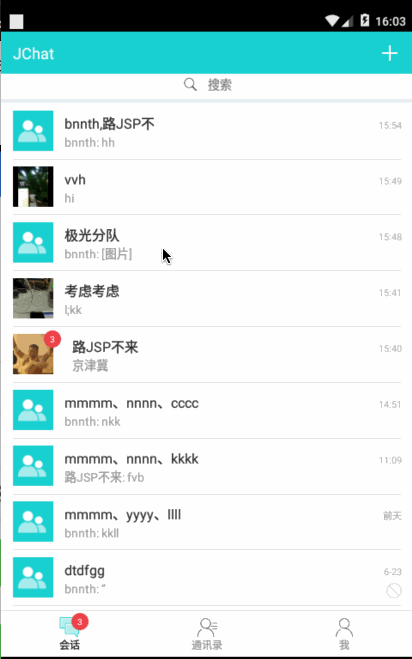
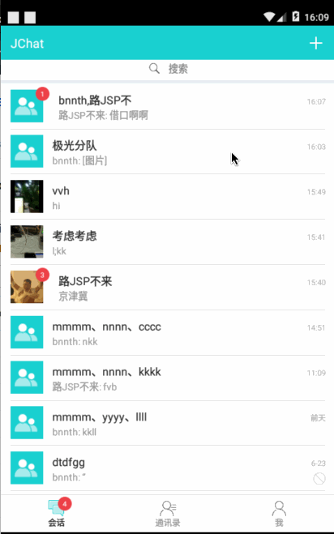
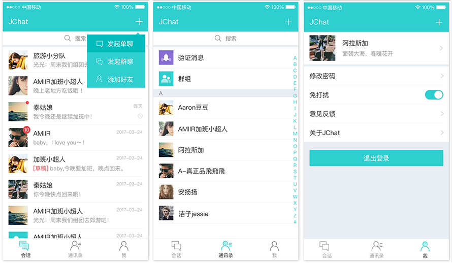

# JChat Android

### 简介

JChat 是基于 JMessage SDK 带有完整 UI 界面的即时通讯应用。 演示即时通讯功能，包括：

* 单聊、群聊、会话列表、好友、通讯录；
* 支持发送文本、图片、语音、表情、位置、小视频；
* 提供用户管理、群组管理、黑名单、免打扰、消息漫游等功能；

JChat 同时具备好友模式和无好友模式：

* 无好友模式：无需将对方加为好友，通过搜索对方的用户名可直接发起聊天。
* 好友模式：可申请将对方加为好友，对方会收到好友验证，验证通过则互为好友关系。

目前已覆盖 Android 、 [iOS](https://github.com/jpush/jchat-swift) 、[Web](https://github.com/jpush/jchat-web)、[Windows](https://github.com/jpush/jchat-windows)平台，开发者可参照 JChat 快速打造自己的 APP，提高开发效率。    

* 更换 AppKey
    - 在 AndroidManifest.xml 文件中把 JChat 的 AppKey 替换成自己项目的 AppKey
* 更换包名
    - 在 build.gradle 把 defaultConfig 节点下的 applicationId 替换成自己项目的包名

        


### 应用截图



### 搭建环境
* 如需发送地理位置功能，需要在 AndroidManifest.xml 中配置一下百度地图的 API AccessKey：
```
<meta-data android:name="com.baidu.lbsapi.API_KEY"
            android:value="UAkQeBK84ioVGzYgA1rSWYfuD4xYtpmV"/> // 将这个 value 替换成自己的
```

### JChat 的工程结构
* JChat 的架构模型参考了 Android Passive MVC 架构(但是去掉了 Listener 模块)，有兴趣的可以[参考这里](http://pan.baidu.com/s/1mhoms4o)以及这篇文章[《Android Passive MVC 架构》](http://www.jianshu.com/p/1af58b6e8930)
  
  - Application —— 主要作用是 jmessage-sdk 的初始化以及 Notification 的相关设置；
  
  - activity 包 —— JChat 的 Activity 的集合，主要负责绑定 Controller 和 View，以及界面的跳转；
  
  - controller 包 —— 主要负责事件的点击、数据处理等，是 Activity 和 View 的中间层；
  
  - view 包 —— 主要负责界面的展示、控件的初始化、点击事件的绑定等；
  
  - adapter 包 —— 主要负责 ListView 或 GridView 的数据处理；
  
  - tools 包 —— 工具类的集合。
  
### JChat项目中用到的部分开源项目
- ActiveAndroid —— 对象关系映射（ORM）操作数据库
- EventBus —— 在组件之间传递消息
- Picasso —— 加载、显示、缓存图片
- 百度地图

### 特别说明
* JChat Eclipse版本需要开发者自己切换到eclipse-jchat分支.注:Eclipse版本以后不再维护更新.
* JChat 是一个单独的完整项目,不能作为module添加到其他项目中

### 相关文档

* [JMessage Android 集成指南](https://docs.jiguang.cn/jmessage/client/jmessage_android_guide/)
* [JMessage Android 开发指南](https://docs.jiguang.cn/jmessage/client/im_sdk_android/)
* [JMessage Android API Docs](https://docs.jiguang.cn/jmessage/client/im_android_api_docs/)
